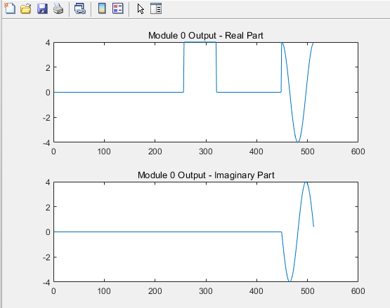
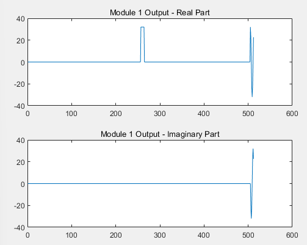
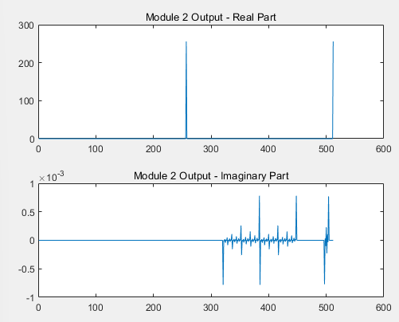
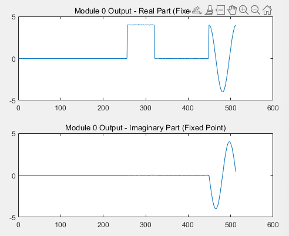
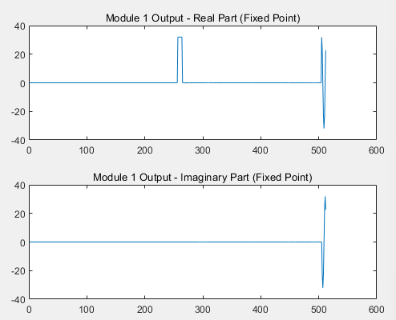
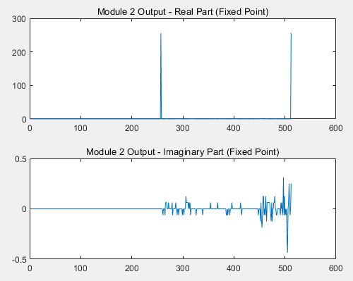
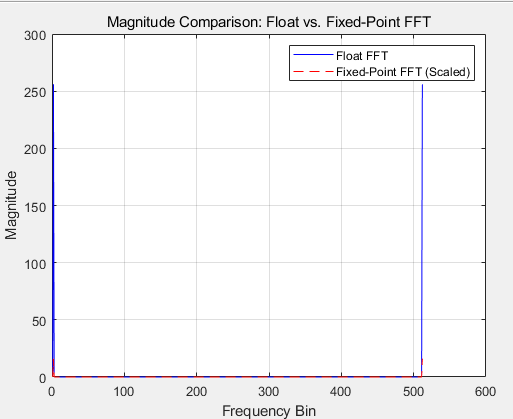
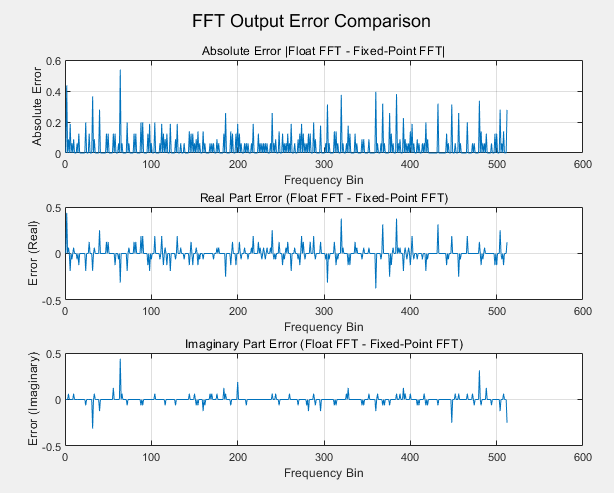
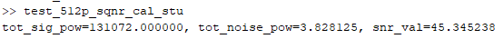

# 🙋‍♂️Who Made?

|                                                                                                      Hyenwoo Choi                                                                                                      |
| :--------------------------------------------------------------------------------------------------------------------------------------------------------------------------------------------------------------------: |
| [   @HyenWoo Choi](https://github.com/drgn88) |

# 🏕️Development Environment

Language
- System Verilog(Design & Verification)
- Verilog
- Matlab(Algorithm Verification)

Tool
- VCS & Verdi
- Matlab
- Verdi랑 차이 비교해볼려고 여기서도 돌려봄

# 1. Floating Point Design

# 2. Fixed Point Design

## Fixed Point 정의

- 입력: Q<3.6>
- Twiddle Factor: Q<2.7>
- 출력: Q<9.4>

| Module0 | step0_0 | step0_1 | step0_2 |
| :-----: | :-----: | :-----: | :-----: |
| &nbsp;  | Q<4.6>  | Q<6.6>  | Q<7.6>  |

| Module1 | step1_0 | step1_1 | step1_2 |
| :-----: | :-----: | :-----: | :-----: |
| &nbsp;  | Q<8.6>  | Q<8.6>  | Q<7.6>  |

| Module2 | step2_0 | step2_1 | step2_2 |
| :-----: | :-----: | :-----: | :-----: |
| &nbsp;  | Q<8.6>  | Q<8.6>  | Q<9.4>  |

> 최대 비트가 15비트를 넘지않도록 설정

## Round Saturation 방식
- 소수부: Truncation
  - fi: RoundingMethod = Zero
- Overflow: Saturation
  - fi: OverflowAction = Saturation

## 🥊결과 비교: Floating Vs Fixed

### 1️⃣Floating

|                     Mod0                     |                     Mod1                     |                     Mod2                     |
| :------------------------------------------: | :------------------------------------------: | :------------------------------------------: |
|  |  |  |

### 2️⃣Fixed

|                  Mod0                  |                  Mod1                  |                  Mod2                  |
| :------------------------------------: | :------------------------------------: | :------------------------------------: |
|  |  |  |

> Mod1까지는 비슷한 양상으로 가다, Mode2의 허수부에서 차이가 보이기 시작한다

### 🔎Detail

|                 Magnitude Compare                 |
| :-----------------------------------------------: |
|   |

> 비슷한 양상을 보이며 겹치는 것을 확인

|        Error Between Floating Vs Fixed        |
| :-------------------------------------------: |
|   |

> Absolute Error가 평균 0.5이하로 존재하는 것을 확인할 수 있다.

## SQNR

> SQNR = $10log(P_Signal/P_Noise)$
> > SQNR이 클수록 신호의 세기가 크다

### 📈Cosine

|                 SQNR_Cosine                 |
| :-----------------------------------------: |
|   |
|                   45.34dB                   |

### 🔢Random

|                 SQNR_Random                 |
| :-----------------------------------------: |
|   |
|                 mean = 38dB                 |

> Random의 경우 38dB에서 왔다갔다 하는 정도

## ⚠️Notice

- 

# 3. CBFP -  Fixed Point SQNR Solution

## 기존: 단계별 Fixed Point
- 기존 FFT에 고정소수점 연산 경우
  - 단계별로 고정소수점 비트를 증가시킴(단계별 Scaling)
  - 무한정 비트수를 증가시킬 수 없음
  - 예를 들어 연산과정이 길어질 수록 비트 수를 계속 증가시킬 수 없음
    - ⚠️HW Resource 문제

## Block Floating Point(BFP)

- 각 FFT 스테이지에서 전체 블록(N개)의 최대값 계산
  - 공통 스케일을 적용
  - 각 스테이지에서의 최대값을 먼저 계산해서 최대의 고정소수점 비트를 미리 계산함
- ⚠️ 고정 소수점 방식으로 연산 진행시
  - 연산을 진행할수록 오버플로우 방지 위해 비트수 계속 증가
  - 연산 스테이지가 길면? ➡️ 비트수가 무한정 증가
- BFP 사용시
  - 출력의 결과들 중에서 가장 큰 값에 맞추어 스케일링
  - 비트수를 연산 때마다 늘리지말고
  - 결과 중에 가장 큰 값에 맞추어 scaling해줌
  - 그러면 비트 수를 무한정 늘리지 않아도 됨

### 문제: PipeLine Problem

- 전체 블록의 최대값을 알아야함
  - 전체 출력이 나올때까지 기다려야함
- 하지만 파이프라이닝은 모든 스테이지가 동시에 진행됨
  - 우리 FFT 코드만 보더라도
    - shift reg에서 나오는 값과 들어오는 값이 연속적으로 처리되어서 그게 바로 다음 스테이지로 넘어감
  - 한 스테이지의 모든 출력이 나올때까지 기다리지 않음
  - ❗파이프라인이 안되는 이유

## CBFP(Convergent Block Floating Point)
> 수렴형 BFP

- 파이프라인 구조에 적합하게 BFP를 수정
- BFP는 하나의 스테이지에서 모든 출력이 나올때까지 대기
- 예를 들어 512 포인트면, 512개의 출력이 나올때까지 대기
  - 512 클럭 사이클동안 대기해야함

- CBFP
  - N point를 여러개의 블럭으로 나눔
  - N point를 예를 들어 N/4블록으로 나누면
  - N/4사이클만 대기하면됨
  - 그러고 다음 스테이지로 파이프라인해서 넘김
  
- 대신 각 블럭에 대해서 exponent가 달라짐
  - 오히려 각 블럭에 대해 exponent설정하는게 정밀도 ⬆️
  - 모든 출력에 대해 exponent를 적용하는 것보다 블록별 exponent가 국소적 최적화 좋음

### ❓BFP에서 정밀도 손실 발생 이유

[예시]
- 8비트 고정소수점
  - -128~127까지 표현
- X = [1.0, 0.1, 0.01, 0.001]

| 실제 값 | 스케일링 후 값 (127x) | 정수 표현 | 오차   |
| ------- | --------------------- | --------- | ------ |
| 1.0     | 127                   | 127       | 0      |
| 0.1     | 12.7                  | 13        | +0.3   |
| 0.01    | 1.27                  | 1         | -0.27  |
| 0.001   | 0.127                 | 0         | -0.127 |

- 작은 값들은 정수표현에서 잘려나감
  - ⚠️**Underflow**

### Summary

| 방식                         | 큰 값                  | 작은 값                               |
| ---------------------------- | ---------------------- | ------------------------------------- |
| 전체 기준으로 스케일링 (BFP) | 👍 정확함               | ❌ 비트 손실로 부정확                  |
| 블록 기준 스케일링 (CBFP)    | ✅ 블록 안에서만 정규화 | ✅ 작은 값도 상대적으로 크게 표현 가능 |

## 비교) BFP Vs CBFP

| 항목            | BFP            | CBFP                   | Floating Point |
| --------------- | -------------- | ---------------------- | -------------- |
| 스케일 단위     | 전체 블록(N개) | 블록당 (ex: N/4)       | 샘플당         |
| 정밀도(SNR)     | 보통           | 더 좋음 (최대 +3\~5dB) | 최고           |
| 연산 복잡도     | 낮음           | 약간 증가 (+4%)        | 높음           |
| 하드웨어 적합성 | 배치형         | 파이프라인 최적        | 부적합         |
| 메모리 효율     | 좋음           | 좋음                   | 나쁨           |
